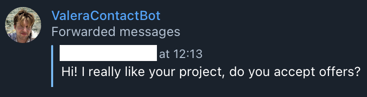

# Contact Bot
> Let's free up you personal space!

### Try it here: https://t.me/ValeraContactBot

## Why
- Fast by using async [aiogram](https://docs.aiogram.dev/en/latest/) framework.
- Lets you avoid spam messages into your main account.
- Convenient for recruiters to instantly get your fresh CV.
- Recruiters can get to know your better with one command /about.
- As an admin user you can see what people send to your bot.

## Clone repo
```sh
git clone https://github.com/valerii-chirkov/TgContactBot.git
```

## Preparation
1. There is env.example in the project, you need to rename it:
`env.example -> .env`
2. Then you need to provide your access tokens and variables
- BOT_NAME - The name of your bot, e.g. ValeraContactBot
- BOT_TOKEN - [Secret token from @BotFather](https://www.siteguarding.com/en/how-to-get-telegram-bot-api-token)
- ADMIN_ID - [Your personal ID or ID of admin user](t.me/userinfobot)
- Also get your CV prepared, because we need to place it to /files:
`files/place_your_cv_here.pdf -> files/your_cv_file.docx`
CV_FILENAME - The name of your resume, e.g. your_cv_file.docx

Logs of the bot could be found here:
`logs/contact_logs`

## Start the bot
```
sudo docker-compose up --build -d
```

## Examples
**User sends a message:**
- *What user sees:*


- *What admin sees:*


**User requests a cv:**
- *What user sees:*


- *What admin sees:*


## Related
- [TgAnimeBot](https://github.com/valerii-chirkov/TgAnimeBot) - Watch anime in telegram
